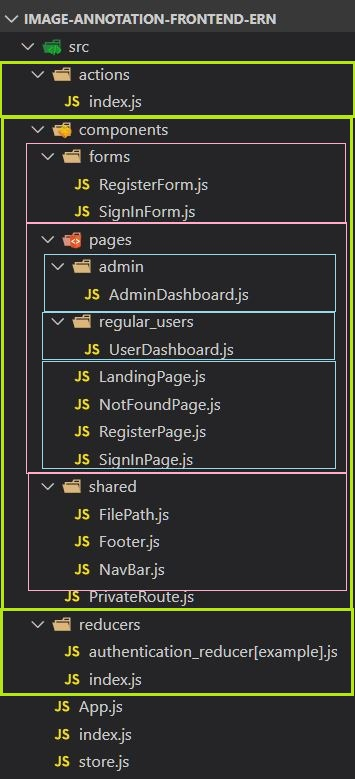

# README

### NPM packages

- Frontend (React)

```javascript
//Essential
"axios": "^0.19.1",
"react-router-dom": "^5.1.2",
"react-redux": "^7.1.3",
"redux": "^4.0.5"
"redux-form": "^8.2.6",
"redux-thunk": "^2.3.0"


//CSS framework
// 1. Need to decide what to use (e.g. bootstrap, material design or others)
// 2. Check 'https://bundlephobia.com/' for cost of npm package
// 3. Do you guys wanna use 'SASS'? Or just CSS framework (e.g. bootstrap) with plain CSS?
// "bootstrap": "^4.4.1",
// "react-bootstrap": "^1.0.0-beta.16",
// "node-sass": "^4.13.0",
// "normalize.css": "^8.0.1",

},
```

- Backend (Express)

```javascript
 "dependencies": {
    "aws-sdk": "^2.607.0",
    "celebrate": "^11.0.1",
    "cors": "^2.8.5",
    "dotenv": "^8.2.0",
    "express": "^4.17.1",
    "jsonwebtoken": "^8.5.1",
    "local": "^0.3.3",
    "mongoose": "^5.8.7",
    "morgan": "^1.9.1",
    "multer": "^1.4.2",
    "multer-s3": "^2.9.0",
    "passport": "^0.4.1",
    "passport-jwt": "^4.0.0",
    "passport-local-mongoose": "^6.0.1",
    "uuid": "^3.4.0"
  },
  "devDependencies": {
    "forever": "^2.0.0",
    "nodemon": "^2.0.2"
  }
```

---

- Structure in drawing


