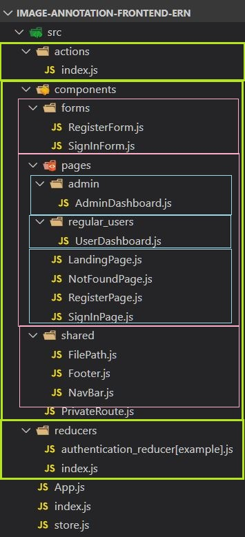

# README

## NPM packages

### Frontend 

#### Dependencies 

"@testing-library/jest-dom": "^4.2.4”, - A Javascript testing framework designed to ensure correctness of our Javascript codebase.
 
"@testing-library/react": "^9.4.0”,- a lightweight solution for testing react components.

"@testing-library/user-event": "^7.2.1”,- tries to simulate the real events that would happen in the browser as the user interacts with it. 

"axios": "^0.19.1”, - A promise based HTTP client similar to the Fetch API. 

"bootstrap": "^4.4.1”,- An open source toolkit for developing with HTML, CSS and JS. 

"bootswatch": "^4.4.1”,- An open source resource for Bootstrap themes. 

"jquery": "^3.4.1”,- A fast, feature-rich JavaScript library which makes Javascript easier to use. 

"popper.js": "^1.16.1”,- a positioning engine. It cacluatates the position of an element to make it possible to position it near a given reference element. 

"react": "^16.12.0”,- Javascript library created by Facebook. Used for building UI components. 
"react-bootstrap": "^1.0.0-beta.16”,- Predefined styling for react components. 

"react-dom": "^16.12.0”,-A package that provides DOM specific methods that can be used in a web application to enable the management of DOM elements in a web page. 

"react-redux": "^7.1.3”,- the offical Redux UI binding library for REACT. 

"react-router-dom": "^5.1.2”,-A package that enables for routing within our REACT application. 

"react-scripts": "3.3.0”,- a set of scripts that allow us to begin projects without the need for additional configuration. 

"redux": "^4.0.5”,- a package that allow one to write applications that behave consistently, run in different environments and are easy to test. Also manage state! 

"redux-form": "^8.2.6”,-A package that helps manage state in the creation of forms. 

"redux-thunk": "^2.3.0”- redux middleware.

#### Dev Dependencies

"cypress": "^3.8.3”- A package that enables the testing of various features within our applications. 

### Backend 

#### Dependencies 

"aws-sdk": "^2.607.0”,- The SDK helps take the complexity out of coding by providing JavaScript objects for AWS services including Amazon S3, Amazon EC2, DynamoDB, and Amazon SWF. 

"celebrate": "^11.0.1”- celebrate is an express middleware function that wraps the Job validation library. This allows you to use this middleware in any single route, or globally, and ensure that all of your inputs are correct before any handler function.

"cors": "^2.8.5”- Cross-Origin Resource Sharing (CORS) is a mechanism that uses additional HTTP headers to tell browsers to give a web application running at one origin, access to selected resources from a different origin. A web application executes a cross-origin HTTP request when it requests a resource that has a different origin (domain, protocol, or port) from its own.

"dotenv": "^8.2.0”- Dotenv is a zero-dependency module that loads environment variables from a .env file into process.env. Storing configuration in the environment separate from code is based on The Twelve-Factor App methodology.

"express": "^4.17.1”- Fast, unopinionated, minimalist web framework for node.

"jsonwebtoken": “^8.5.1- JSON Web Token (JWT) is a compact, URL-safe means of representing claims to be transferred between two parties.  The claims in a JWT  are encoded as a JSON object that is used as the payload of a JSON Web Signature (JWS) structure or as the plaintext of a JSON Web Encryption (JWE) structure, enabling the claims to be digitally signed or integrity protected with a Message Authentication Code (MAC) and/or encrypted.

"local": "^0.3.3”- local-npm is a Node server that acts as a local npm registry. It serves modules, caches them, and updates them whenever they change.

"mongoose": "^5.8.7”- Mongoose is a MongoDB object modeling tool designed to work in an asynchronous environment.

"morgan": "^1.9.1”- HTTP request logger middleware for node.js

"multer": "^1.4.2”- Multer is a node.js middleware for handling multipart/form-data, which is primarily used for uploading files. It is written on top of busboy for maximum efficiency.

"multer-s3": "^2.9.0”- Streaming multer storage engine for AWS S3.

"passport": "^0.4.1”- Passport is Express-compatible authentication middleware for Node.js. Passport's sole purpose is to authenticate requests, which it does through an extensible set of plugins known as strategies.

"passport-jwt": "^4.0.0”- A Passport strategy for authenticating with a JSON Web Token.

"passport-local": "^1.0.0”- Passport strategy for authenticating with a username and password.

"passport-local-mongoose": "^6.0.1”- Passport-Local Mongoose is a Mongoose plugin that simplifies building username and password login with Passport.

"uuid": "^3.4.0”-  image name on S3 

#### Dev Dependencies 

"forever": "^2.0.0”- A simple CLI tool for ensuring that a given node script runs continuously (i.e. forever)

"nodemon": "^2.0.2”-  Simple monitor script for use during development of a node.js app.

"jest": "^25.1.0”- Complete and ready to set-up JavaScript testing solution. Works out of the box for any React project.

 "supertest": "^4.0.2”- HTTP assertions made easy via superagent.

- Structure in drawing

