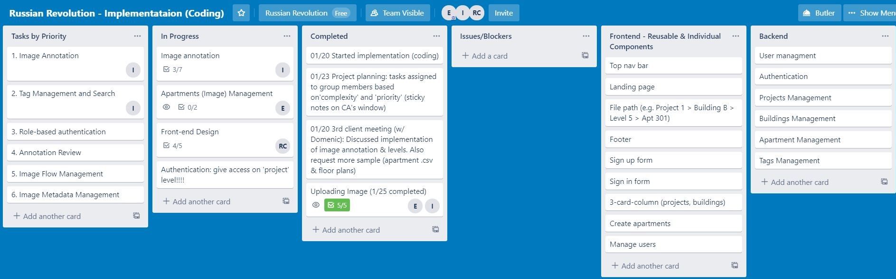

# MERN Project - Pricing Portal (Robbie, Nina & Ellie)

---

### Links

- **Deployed Website (React Application)**: http://pricing-portal-prod-ern.s3-website-ap-southeast-2.amazonaws.com/

- **GitHub Repo - Frontend**: https://github.com/EllieChen-Git/frontend-pricing-portal-ERN

- **Deployed Server (Express API)**: https://pricing-portal.herokuapp.com/

- **GitHub Repo - Backend**: https://github.com/INRokh/backend-pricing-portal-ERN

- **Trello Board for Part A - Documentation**: https://trello.com/b/0v9PguSo/mern-project-russian-revolution

- **Trello Board for Part B - Implementation**: https://trello.com/b/uaooTZA0/russian-revolution-implementataion-coding

---

### Purpose

The purpose of Pricing Portal is to allow accurate manual image annotation of property features within apartment floor plans, in order to more effectively evaluate apartment pricing. In the future, this will also allow our client to incorporate this project with computer vision and machine learning.

---

### Target Audience

The target audience for our application is our client Skychute and professionals within the real estate industry. Another group of our target audience is other developers who are interested in image annotation techniques.

---

### Features

**1. Image Annotation** - Users are able to tag certain features of an image using one or more tags. The data will automatically be saved to the database every time a user modifies a tag. The users are able to indicate when the annotation of an image is finished through saving the amended image (all the tags are placed). After submitting the image, the users are not be able to modify their tags.

**2. Basic Tag Management** - Users are able to create and delete tags for image annotation. Tags are globally accessible to users across the system.

**3. Role-based authentication** - Users have access to different elements of the application based on their roles (admin or regular users) and basic Access Control Lists (ACLs).

**4. Annotation Review** - Users are able to review annotation results, and decide to either approve or reject annotations (If an annotation is rejected, it will be sent back to users for re-annotation).

**6. Basic Image Metadata Management** - Users are able to add metadata to the image annotation through manually adding key and value pairs.

---

### Future Features

**1. Advanced Image Metadata Management** - Users will be able to upload a CSV document, which contains metadata of an image (including image URLs).

**2. Image Flow Management** - Users will be able to organise images hierarchically through the system (e.g. Projects -> Buildings -> Levels -> Apartments).

**3. Advanced Tag Management and Tag Search** - Users will be able to search from existing tags and modify/update tags during the image annotation process.

**4. Advanced Role-based Authentication** - On top of basic role-based authentication, admin users can be grouped into different admin teams. Admin users will not be able to see the projects created by other admin teams.

**5. Image Navigation** - Users will be able to zoom in and out the image and to drag the image for better user annotation experience.

---

### Application Architecture Diagram

---

### Dataflow Diagram

- **Logical dataflow diagram Level 0**: An overview of the whole system.

- **Logical dataflow diagram Level 1**: A more detailed breakdown of the Context Level Diagram (Level 0).

---

### Client Communication

Initially, our client reached out to us on LinkedIn about this project idea. After several exchanges, Ellie and Nina went to the client's office for the first client meeting to discuss their requirements for the pricing portal system.

After that, the clients (the project manager and the lead engineer) and us (Robbie, Nina and Ellie) have communicated through our slack channel. We had 4 meetings with our client during the whole project time and we also demonstrated our MVP to them in order to collect their feedback before we completed the project.

The lead engineer actually came to our presentation and also did manual testing on the spot for us, and the project manager sent us a video before the presentation. They are both very happy with our end results and will incorporate our project in their future products.

- **Client reached out to us**

- **Client described project idea**

- **Client provided more data through slack**

---

### Project Management Methodology

For this project, we followed the agile methodology and use Kanban board to record our project management process. We would first list out all the tasks and use planning poker to categorise our tasks based on complexity and priority.

In terms of team collaboration, Nina has strong knowledge and background in backend, so she designed our database schema and implemented the data structure for our application. Ellie and Robbie spent more time on frontend design and the documentation. From time to time, Ellie and Robbie also worked on some backend functions while Nina also helped with the front-end styling.

We distributed the major tasks based on features and created different branches for these features on our GitHub repos. Nina was in charge of image annotation (both backend and frontend), Ellie was on image uploading (both backend and frontend) while Robbie implemented different user components to make role-based authentication (admin and users) happened. Robbie also did testing of the application.

---

### Screenshots of Trello board

- **Part A - Documentation** - Started the project
  

- **Part A - Documentation** - Submitted Part A

- **Part B- Implementation (Coding) - Started coding**

- **Part B- Implementation (Coding) - Tasks breakdown**

.JPG>)

- **Part B- Implementation (Coding) - After demonstrating our MVP to client**

### Screenshots of Pricing Portal

- **Landing Page**

- **Register**

- **Apartments Management (Create apartments, assign annotation to users, show floor plan, show list of apartments)**

- **Manage Users**

- **Review List & Annotation Review**

.JPG>)

.JPG>)

- **Annotation List**

- **Image Annotation**

---

### User Stories

**ALL USERS**

- **Angel**: As a user, I would like to sign-up for an account, so I can log into my account on the website later.
- **Jurra**: As a user, I would like to log into my existing account, so I can use the functionalities provided by the website.
- **Tom**: As a user, I would like to browse the website on my mobile, computer and my tablet, so I can use this application on different devices.
- **Ellie**: As a user, I would like to sign-out from the website, so my account is more secure.

**ADMINS**

- **Nina**: As the CEO of Skychute, I would like to organise images in a certain structure, so it is easier for our company to maintain the data.
- **Mark**: As a developer at Skychute, I would like to grant some users admin access, so we can have more admin users to manage our projects.
- **Robbie**: As a Project Manager at Skychute, I would like to assign projects and buildings to regular users, so users can tag the features on the floor plan images.
- **Elliot**: As a Project Manager at a construction company, I would like to add, view, update and delete projects.
- **Wayne**: As a Project Manager at Skychute, I would like to add, view, update and delete buildings.
- **Alex**: As a Project Manager at a construction company, I would like to add, view, update and delete apartments.
- **Prad**: As a Project Manager at Skychute, I would like to upload floor plan images and enter apartment information to apartments.
- **Ragan**: As a Project Manager at Skychute, I would like to review tagged floor plans submitted by regular users, so I can manage the project progress.
- **Dale**: As a Project Manager at Skychute, I would like to have the ability to reverse the status tagged floor plans (from ‘completed’ back to ‘editable’), so users can edit it again.

**Regular Users**

- **Luke**: As a Property Valuer, I would like to tag the property features on the floor plans, so I can better evaluate the property price.
- **Chelsea**: As a Real Estate Agent, I would like to create, read, remove and delete tags, so I can manage the tags as I wish.
- **Max**: As a Real Estate Agent, I would like to save the tagged plans multiple times before submission, so I can go on a coffee break and come back to the image I am working on.

---

### Wireframes

- **All Users - Landing Page**

- **All Users- Register Account**

- **All Users - Landing Page**

- **Admin - Create Projects**

- **Admin - Create Buildings**

- **Admin - Create Apartments**

- **Admin - Manage Users**

- **Users - User Dashboard**

- **Users - User Buildings**

- **Users - User Dashboard**

---

### Tech Stack

**Application and Data**

- **JavaScript**: A high-level, just-in-time compiled, multi-paradigm programming language that conforms to the ECMAScript specification.

- **React**: A JavaScript library for building user interfaces.

- **MongoDB**: A cross-platform document-oriented (non-relational) database program.

- **Express**: A web application framework for Node.js.

- **Node**: An open-source, cross-platform, JavaScript runtime environment that executes JavaScript code outside of a browser.

- **Amazon S3**: A service offered by Amazon Web Services that provides object storage through a web service interface.

- **HTML5**: A software solution stack that defines the properties and behaviours of web page content by implementing a markup-based pattern to it.

- **CSS3**: A style sheet language used for describing the presentation of a document written in a markup language like HTML.

**Utilities**

- **Balsamiq**: A mockup tool for wireframing.

- **Trello**: A web-based Kanban-style list-making application.

- **Pinterest**: A tool to store images for ideas of mood board.

**Developer Operations**

- **GIT**: A free and open version control system.

- **GitHub**: A platform for source control.

- **GitKraken**: A Git GUI client for Windows, Mac and Linux. It helps developers become more productive and efficient with Git.

- **Heroku**: A platform for deploying our application.

- **JEST**: A delightful JavaScript Testing Framework with a focus on simplicity.

**Business Tools**

- **Slack**: A cloud-based proprietary instant messaging platform for communication within team and with client.

- **Google Docs**: A tool for documentation collaboration.

---

### Dependencies/Libraries

**Frontend**

- **axios**: A promise based HTTP client similar to the Fetch API.
- **bootstrap**: An open source toolkit for developing with HTML, CSS and JavaScript.
- **bootswatch**: An open source resource for Bootstrap themes.
- **jquery**: A fast, feature-rich JavaScript library which makes JavaScript easier to use.
- **popper.js**: A positioning engine. It calculates the position of an element to make it possible to position it near a given reference element.
- **react-bootstrap**: Predefined styling for react components.
- **react-redux**: The official Redux UI binding library for REACT.
- **react-router-dom**: A package that enables for routing within our REACT application.
- **redux**: A package that allow one to write applications that behave consistently, run in different environments and are easy to test. Also manage state!
- **redux-form**: A package that helps manage state in the creation of forms.
- **redux-thunk**: A redux middleware.
- **cypress**: A package that enables the testing of various features within our applications.

**Backend**

- **aws-sdk**: The SDK helps take the complexity out of coding by providing JavaScript objects for AWS services including Amazon S3, Amazon EC2, DynamoDB, and Amazon SWF.
- **celebrate**: Celebrate is an express middleware function that wraps the Job validation library. This allows you to use this middleware in any single route, or globally, and ensure that all of your inputs are correct before any handler function.
- **cors**: Cross-Origin Resource Sharing (CORS) is a mechanism that uses additional HTTP headers to tell browsers to give a web application running at one origin, access to selected resources from a different origin. A web application executes a cross-origin HTTP request when it requests a resource that has a different origin (domain, protocol, or port) from its own.
- **dotenv**: Dotenv is a zero-dependency module that loads environment variables from a .env file into process.env. Storing configuration in the environment separate from code is based on The Twelve-Factor App methodology.
- **jsonwebtoken**: JSON Web Token (JWT) is a compact, URL-safe means of representing claims to be transferred between two parties. The claims in a JWT are encoded as a JSON object that is used as the payload of a JSON Web Signature (JWS) structure or as the plaintext of a JSON Web Encryption (JWE) structure, enabling the claims to be digitally signed or integrity protected with a Message Authentication Code (MAC) and/or encrypted.
- **local**: A Node server that acts as a local npm registry. It serves modules, caches them, and updates them whenever they change.
- **mongoose**: Mongoose is a MongoDB object modelling tool designed to work in an asynchronous environment.
- **morgan**: HTTP request logger middleware for node.js
- **multer**: Multer is a node.js middleware for handling multipart/form-data, which is primarily used for uploading files. It is written on top of busboy for maximum efficiency.
- **multer-s3**: Streaming multer storage engine for AWS S3.
- **passport**: Passport is Express-compatible authentication middleware for Node.js. Passport's sole purpose is to authenticate requests, which it does through an extensible set of plugins known as strategies.
- **passport-jwt**: A Passport strategy for authenticating with a JSON Web Token.
- **passport-local**: Passport strategy for authenticating with a username and password.
- **passport-local-mongoose**: Passport-Local Mongoose is a Mongoose plugin that simplifies building username and password login with Passport.
- **uuid**: image name on S3
- **forever**: A simple CLI tool for ensuring that a given node script runs continuously (i.e. forever)
- **nodemon**: Simple monitor script for use during development of a node.js app.
- **jest**: Complete and ready to set-up JavaScript testing solution. Works out of the box for any React project.
- **supertest**: HTTP assertions made easy via superagent.

---

### Screenshots of Testing

- **Testing 1**

- **Testing 2**

- **Testing 3**

©2020 Robbie, Nina & Ellie (Coder Academy)
